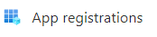
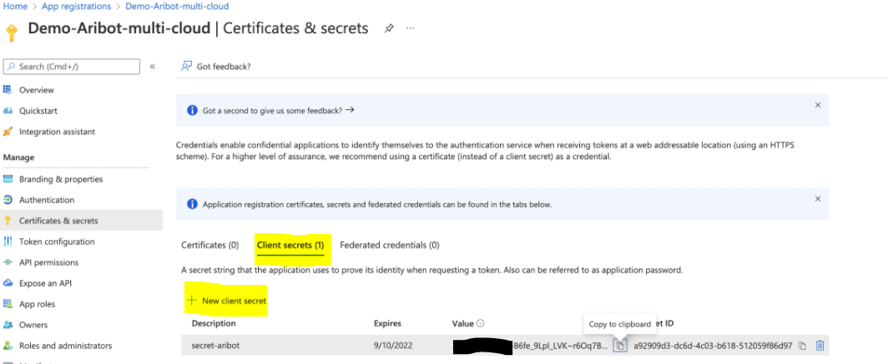
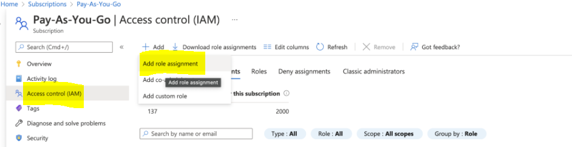
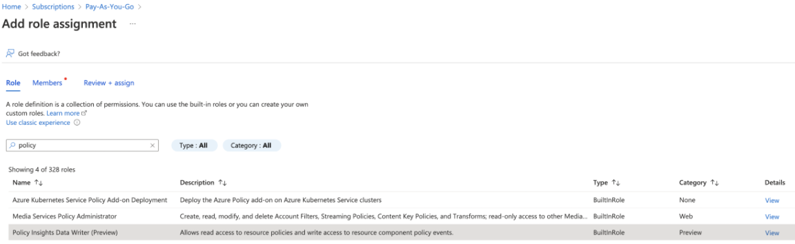
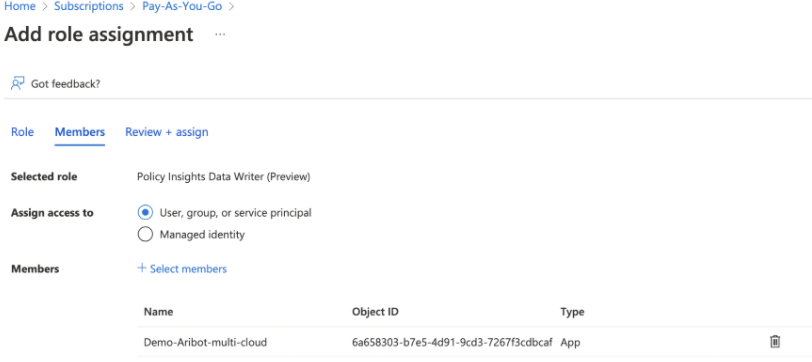

# Aribot

[](https://snyk.io)

## Description

Aribot **works with your DevOps teams** and, thus, those working on the code base and the underlying infrastructure. It also provides deep security insights into  **Kubernetes clusters(AKS)**. It is available in **Free and Paid usage and accessible on the GitHub Marketplace**.

Below are the features summary and **onboarding links **  per **lifecycle stage**:

### Pipeline security
**Streamlines security**: automated reviews, CI/CD integration, Supply Chain standards, reporting, and language agnostic.

https://www.youtube.com/watch?v=RmRNerXjw4Q

### Automated threat modeling
Automates threat modeling: **traceable requirements, NIST 800 53 compliance**, and IaC templates for cloud threats.

https://www.youtube.com/watch?v=qilq_nKpR9k

### Platform security
Enhances cloud security: proactive detection, compliance measurement, continuous scanning, and seamless pipeline integration.

https://www.youtube.com/watch?v=3uHbNdtHrEA


## Usage

1. [Prepare data for credentials](#1-prepare-credentials)
   * [Azure](#azure)
   * [AWS](#aws)
2. [Create credentials](#2-create-credentials)
3. [Install Plugin](#3-install-plugin)
4. [Configure plugin](#4-configure-plugin)
5. [Run a Build](#5-run-build)
6. [Aribot Onboarding](#5-aribot-onboarding)


### 1. Prepare credentials

---

### Azure

**Step 1**
Sign in at Microsoft Azure


**Step 2**
Go to Azure App Registrations




**Step 3**
* Click new registration
* Set the Name nd choose “Accounts in any organizational directory (Any Azure AD directory - Multitenant)” asSupported account type
* Click `Register`


**Step 4**
* Copy values of Application **(Client) ID** and Directory **(Tenant) ID**
* Click to `Add certificate or secret`

* In Client Secrets tab, click on `New Client Secret`
* Fill **Description** and **Expires** fields.
* Copy value of **Value** field



**Step 5**
* Go to account home
* Navigate to your subscription
* You need to assign 3 roles:
  * **Policy Insights Data Writer**
  * **Resource Policy Contributor**
  * **Security Assessment Contributor**

* Go to **Access Control** and click **Add** under **Role assignments**


* Choose the role `Policy Insights Data Writer` and click **Next**



* On `Members` tab, choose `User, group, or service principle` and then `Select Members` for choosing your application your registered earlier.
* Click `Next`
* Review and assign the role

* Repeat it for another two roles. 

**Step 6** 
* You can use the Application ID, Tenant ID and value you copied earlier to complete adding an account.
---

### AWS
** Step 1**
Go to `AWS console -> Users`

**Step 2**
* Add new user by press button `Add users`
* Set `User name` (in the input field)
* `Select AWS credential type`, Set checkbox – `Access key Programmatic access`
* Press `Next: Permissions`
* At the permissions page choose tab
* 
* Press button `Create policy`
On `Create policy` page choose `JSON` and paste content:
```json
{
    "Version": "2012-10-17",
    "Statement": [
        {
            "Sid": "VisualEditor0",
            "Effect": "Allow",
            "Action": [
               "lambda:CreateFunction",
               "config:GetAggregateConfigRuleComplianceSummary",
               "lambda:ListFunctions",
               "iam:PassRole",   
               "config:PutConfigRule",
               "lambda:GetFunction",
               "lambda:PublishLayerVersion",
               "config:StartConfigRulesEvaluation",
               "config:GetComplianceDetailsByResource",
               "lambda:UpdateFunctionCode",
               "config:GetComplianceDetailsByConfigRule",
               "lambda:AddPermission",
               "config:DescribeConfigRules",
               "lambda:DeleteFunction",
               "lambda:PublishVersion",
               "config:DeleteConfigRule"
            ],
            "Resource": "*"
      }
   ]
}
```
* Press button `Next: Tags`
* Set policy `Name` (in the input field)
* Press button `Create policy`
* Go back to `Add User` screen
* Click refresh  User filter to find created Policy
* Choose it (set checkbox) `Policy name`
* Press button `Next: Tags`
* Skip two screens by click `Next`
* At the last screen, click `Show the access secret`
* Copy values `Access ID` and `Access secret`


### 2. Create credentials


### 3. Install plugin


### 4. Configure plugin


### 5. Run a build


### 6. Onboarding

